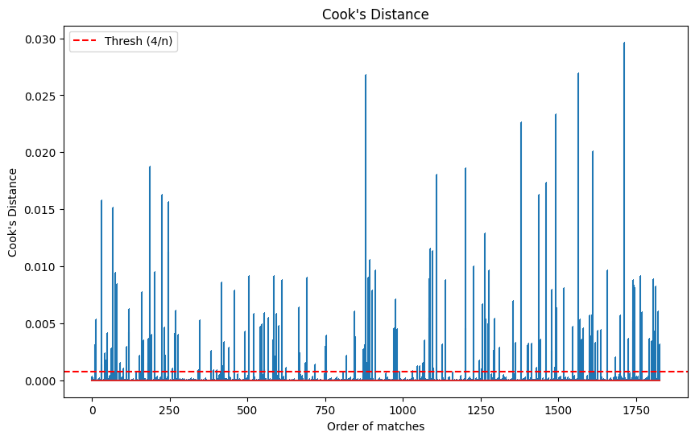

# How Soccer Teams Come Back from Behind in Away Matches: Evidence from the English Premier League

## 1/ Project overview:
Playing away matches is never easy, as players must perform under the pressure of thousands of spectators. The challenge becomes even greater when away teams fall behind on the scoreboard. However, making a comeback in away matches is not impossible, as many matches have shown away teams overturning deficits under hostile conditions. A notable example is Manchester United’s 3–2 victory over Manchester City at the Etihad Stadium in 2018, despite trailing by two goals at halftime.

<p align="center">
  
</p>

In this project, I try to explore the answers to 2 key questions:

**What factors are associated with the away team's chances of making a comeback?**

- **Method:** Regression Analysis.

**How can the away team make a comeback, and what are the most common comeback scenarios?**

- **Method:** K-means Clustering.

The analysis focuses on English Premier League matches from **2011 to 2025**.

The full dataset can be accessed here: [English Premier League Dataset](https://datahub.io/core/english-premier-league)

## 2/ How I define a comeback:

In this project, a comeback is defined as a match where the away team is trailing at halftime but somehow manages to win in the end.

**Limitation:** By defining a comeback this way, matches where the away team is trailing only in the second half and manages to come back would not be counted. However, since this dataset does not include any features for the second half, this is the only feasible definition.

## 3/ What factors are associated with the away team's chances of making a comeback?

To address this question, I will try to interpret the coefficients of a logistic regression model. However, to ensure that the results are reliable, I can only perform the interpretation if the model satisfies all six assumptions below:

- The Response Variable is Binary
- The Observations are Independent
- There is No Multicollinearity Among Explanatory Variables
- There are No Extreme Outliers
- There is a Linear Relationship Between Explanatory Variables and the Logit of the Response Variable
- The Sample Size is Sufficiently Large

The features selected for interpretation are: `AST` (Away Shots on Target), `HF` (Home Fouls), `HST` (Home Shots on Target), `AF` (Away Fouls), `HC` (Home Corners), `AC` (Away Corners), `HY` (Home Yellow Cards), `AY` (Away Yellow Cards), `HR` (Home Red Cards), and `AR` (Away Red Cards), `home_lead_1` (The number of goals by which the home team is leading at halftime). The Target variable is `away_comeback` (1 if the away team makes a comeback, 0 otherwise)

```python
# Code
model = smf.logit(
    'away_comeback ~ AST+HF+HST+AF+HC+AC+HY+AY+HR+AR+home_lead_1',
    data=df1
).fit()

```

First, I fit a logistic regression model using all these variables. This model is only used to calculate the residuals.

**Assumption 1: The Response Variable is Binary**

Since the target feature `away_comeback` is binary, this assumption is satisfied.

**Assumption 2: The Observations are Independent**

To check this assumption, I use the Durbin-Watson test. If the result is approximately 2, it means there is no autocorrelation and the assumption is satisfied.

```python
# Code
dw = durbin_watson(model.resid_dev)
print(dw)

```

```python
# Output
1.9263494659755964

```

=> Based on this result, assumption 2 is satisfied.

**Assumption 3: There is No Multicollinearity Among Explanatory Variables**

I use the VIF (Variance Inflation Factor) test to check whether any features have a VIF score higher than 5.

```python
# VIF test result
Variable        VIF
0         const  45.019332
1           AST   1.176121
2            HF   1.193377
3           HST   1.328959
4            AF   1.231856
5            HC   1.250440
6            AC   1.282166
7            HY   1.264185
8            AY   1.235652
9            HR   1.029591
10           AR   1.024371
11  home_lead_1   1.091098

```
=> Since all features have VIF scores around 1, assumption 3 is satisfied.

**Assumption 4: There are No Extreme Outliers**

This is the most challenging part of the analysis so far. To identify influential points, I calculate the Cook's distance for each sample in the dataset. Typically, any points that exceed the threshold (4/n) are considered influential.

<p align="center">
  
</p

However, this dataset is imbalanced. Matches where the away team makes a comeback are rare events. Out of 1,825 matches, only 110 involve a successful away comeback. As a result, when calculating Cook's distance, all points with `away_comeback` = 1 tend to be flagged as outliers. These points are not data errors, they are genuine events. Removing them would only bias the model. I will keep all of these observations and accept that the coefficients may fluctuate substantially.
